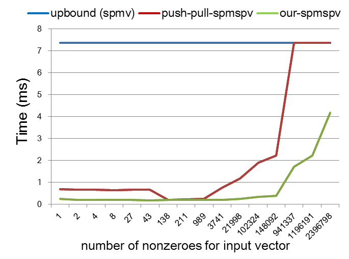

# SpMspV (稀疏矩阵乘稀疏向量)

## 算法描述

$$y = Ax$$ , 其中$$A$$是一个稀疏矩阵，$$x$$ 是一个稀疏向量，$$y$$是结果向量。 

## 存储格式

### 稀疏矩阵

稀疏矩阵采用CSC（Compressed Sparse Column）的存储格式。
CSC格式由3个数组组成：val, row_index, col_offset。
val 数组（长度为nnz）存储所有非零元的值。
row_index数组 （长度为nnz）存储所有非零元的行标。
col_offset (长度为n+1) 存储每一列的第一个非零元的在val数组中的下标。 
Note：nnz代表稀疏矩阵非零元总数。n代表稀疏矩阵的列数。
如图1所示，详细展示了CSC存储格式信息。

 


### 稀疏向量

稀疏向量采用两个数组进行存储： x_key, x_val。
这两个数组的长度都为稀疏向量的非零元个数，记为x_nnz。
x_key 存储的是稀疏向量的非零元的下标。
x_val 存储的是稀疏向量的所有非零元的值。

## 用法

```cpp
// 在GPU上执行SpMspV
SpMspV(m, n, nnz, row_index, col_offset, val, x_nnz, x_key, x_val, y);
```

### 参数

* `m`：稀疏矩阵的行数.
* `n`：稀疏矩阵的列数.
* `nnz`：稀疏矩阵的非零元个数.
* `row_index`：稀疏矩阵的所有非零元的行标.
* `col_offset`:稀疏矩阵的每一列的第一个非零元的在所有非零元中的下标.
* `val`：稀疏矩阵的所有非零元的值.
* `x_nnz`：稀疏向量的非零元个数.
* `x_key`:稀疏向量的非零元的下标，向量，长度为$$x\_{nnz}$$.
* `x_val`:稀疏向量的所有非零元的值，向量，长度为$$x\_{nnz}$$.
* `y`：结果向量，长度为$$m$$.

## 性能

### 性能对比.

  
  


### 随输入向量的非零元个数的变化的性能情况（ljournal-2008数据集）.

 